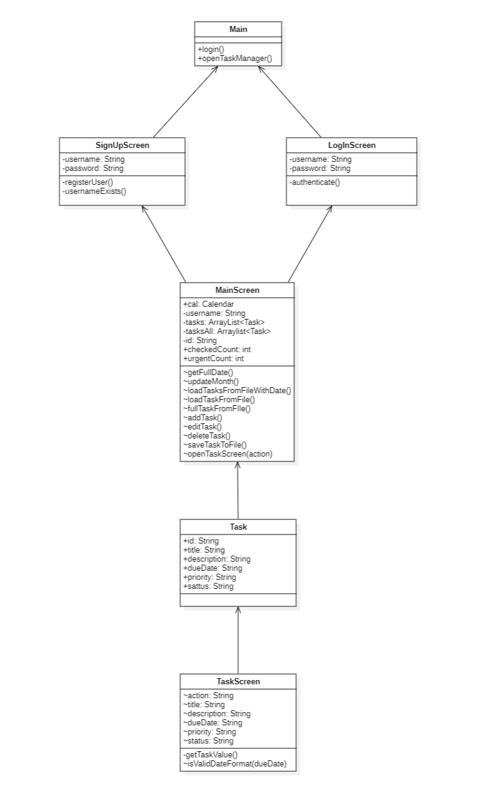
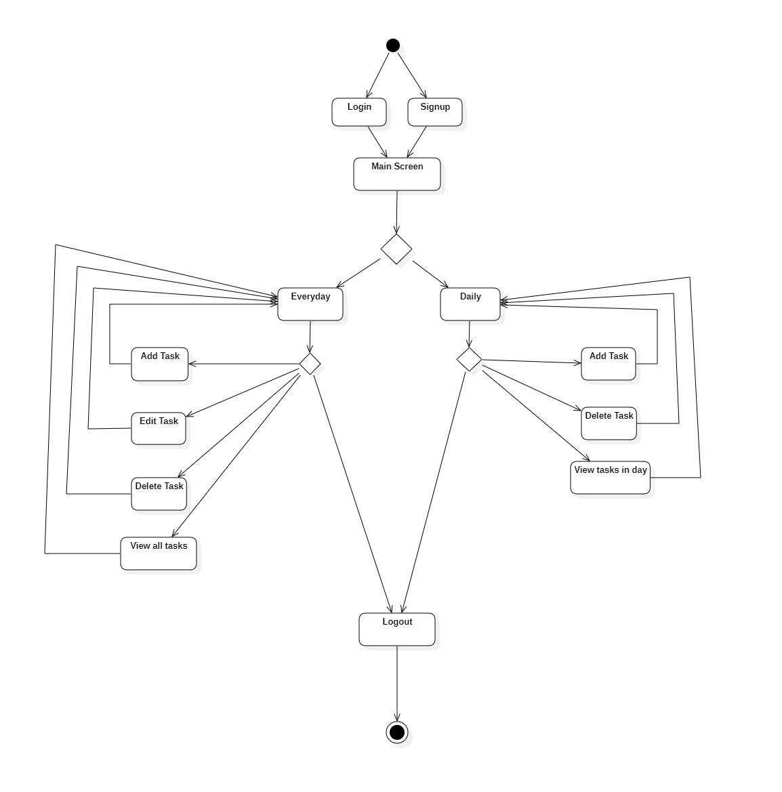

# PROTASKER

## Intro

> This project is the first final assignment of the Object-Oriented Programming course at [ProPTIT](https://proptit.com/).

Realize that the older you get, the more work you have to handle. That's why work management is so important.

This ProTasker application will give you the ability to take notes on tasks to do as well as check and edit them.

## Authors [Nguyễn Bá Việt Hoàng](https://github.com/littlepsyduck)

## Demo

[Video demo](https://drive.google.com/file/d/1MD714LPaeXQI916r8vay2cOzOfkifnNl/view?usp=sharing)

## Screenshots

- Log In Screen


- Sign Up Screen


- Daily Screen


- Everyday Screen


## UML

- Class Diagram



- Activity Diagram



## Features

- Save tasks in individual txt files for each account
- Create new tasks, edit, delete old tasks
- View tasks by date
- View all tasks
- View statistics on the number of existing tasks, the number of completed tasks, and the number of urgent tasks

## Requirements

- Java 11

## Installation

```bash
  - Setup JDK
  - Clone this repository
  - Open folder PROJECT ProTasker
  - Run PROJECT ProTasker/src/application/Main.java
```

## License

[MIT](https://choosealicense.com/licenses/mit/)
